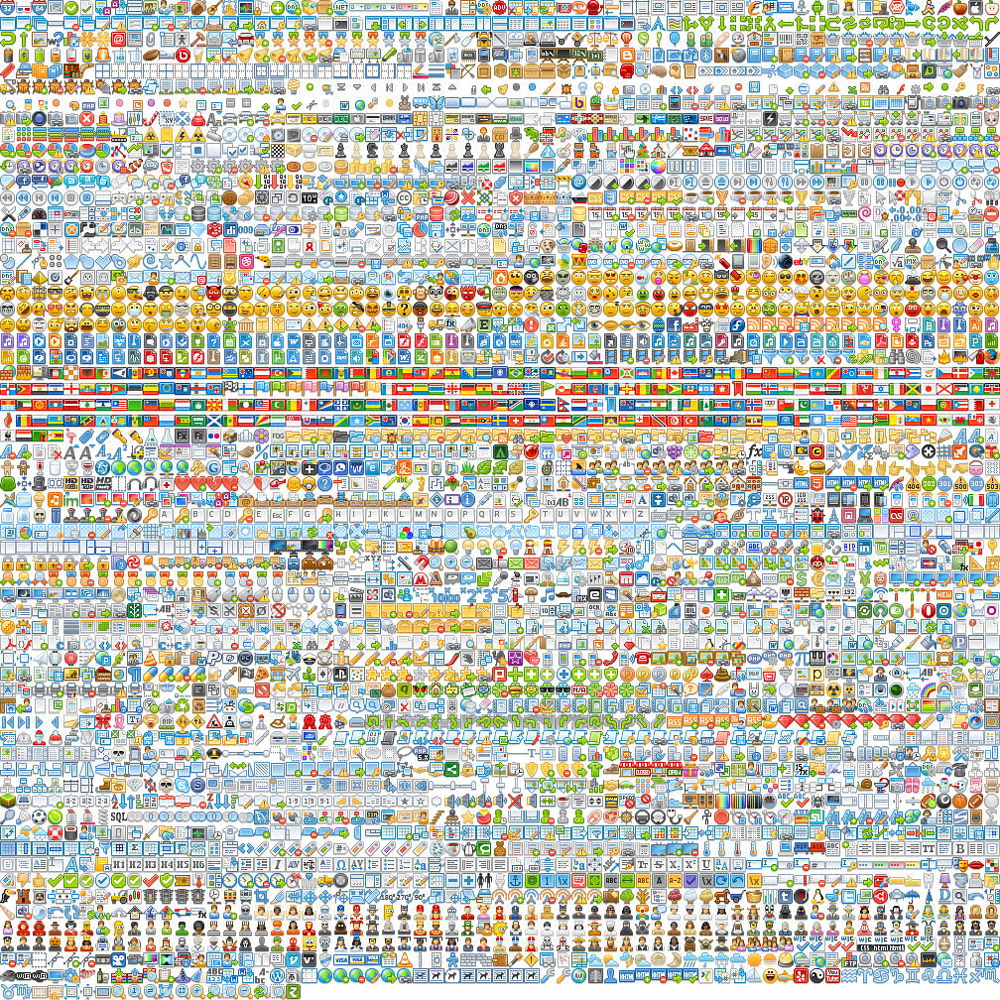
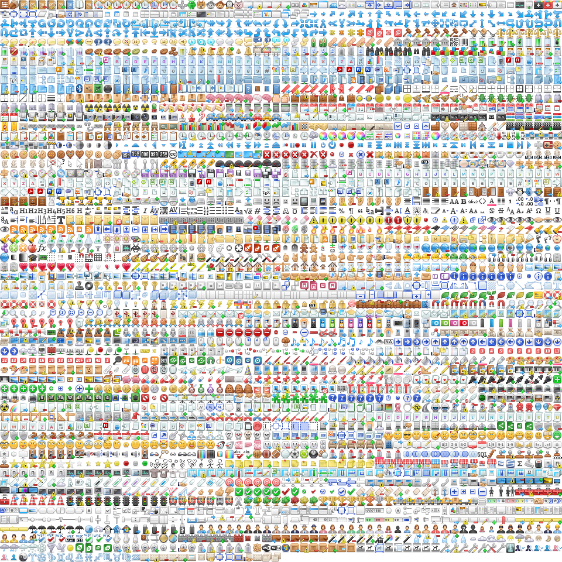

# Icon Archive
This repository contains a collection of popular icon libraries. It includes all raw icons and a sprite sheet with CSS classes for easy use in web projects.

## Attribution
- Silk icons by Famfamfam (https://github.com/markjames/famfamfam-silk-icons)
- Fugue icons by Yusuke Kamiyamane (https://p.yusukekamiyamane.com/)
- FatCow icons (https://github.com/gammasoft/fatcow)
- Crystal Project (https://github.com/thecodingmachine/crystal-project/)

## Icon Libraries Preview





## Python Sprite Generator

This project includes `iconify.py`, a Python script that automatically generates CSS sprites from PNG icon collections.

### Features
- Automatically scans for PNG files in an `./icons` directory
- Creates optimized sprite sheets using ImageMagick
- Generates corresponding CSS with proper background positioning
- Calculates optimal grid layout for maximum efficiency
- Supports any number of 16x16 pixel icons

### Requirements
- Python 3.x
- ImageMagick (with `magick` command available in PATH)

### Usage
1. Place your PNG icons in an `./icons` directory
2. Run the script:
   ```bash
   python iconify.py
   ```
3. The script will generate:
   - `sprite.png` - Combined sprite sheet
   - `sprite.css` - CSS classes for each icon

### Output
The generated CSS provides a base `.sprite` class and individual classes for each icon:
```css
.sprite {
    background: url('sprite.png') no-repeat;
    width: 16px;
    height: 16px;
    display: inline-block;
}
.sprite.icon-name { background-position: -0px -0px; }
```
